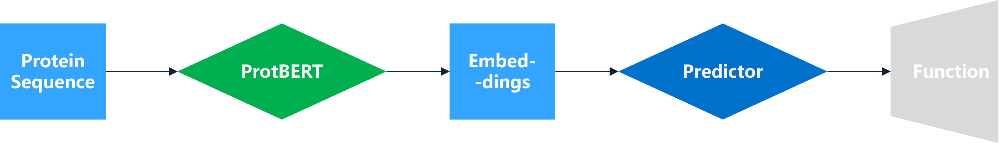
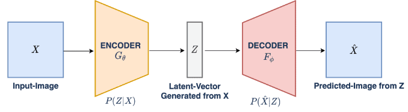

# Introduction
This project mainly aims to predict the function of protein sequence based on the data set provided by CAFA5.
the CAFA5 competation provided large scale and real protein sequences for training and testing, for the protein sequences information, it is saved as fasta file, containing 142246 protein for training with corresponding lable (GO term) and 141865 protein for testing. In fasta file, each protein contains their unique ID, description, and sequence information (in alphabet). 

Due to the restriction of storage space, this project only contains the core project files for embedding and prediction. You can download the dataset (including the embeddings) files via the following link
https://drive.google.com/file/d/1AMGjTnYXA47rkB2skcZ1HMl9pq-007UQ/view?usp=sharing
Or you can download a full and directly executible version of our project (4.99 GB) by
https://drive.google.com/file/d/1r0Ccy57SmXuCvhRoDtfOZpIEbcHmzZhb/view?usp=sharing

Also, you can try to aquire the embedding by yourself by running  training_embedded_protBERT.py and test_embedded_protBERT.py. However you may need to change the location of files before running this code. Also, we set the deafult use of CUDA is on GPU which may cause unforeseeable bugs.

A workflow of our project is shown as below which may be helpful when you check the codes.

Here we choose two different type of predictors Neural Network and Variational Autoencoder. You can run different code chunk to test these two different predictors.
